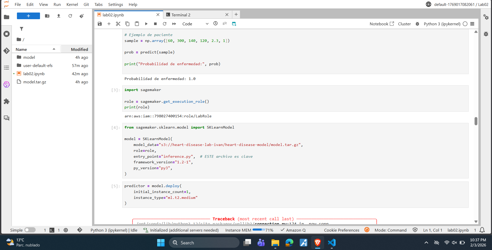
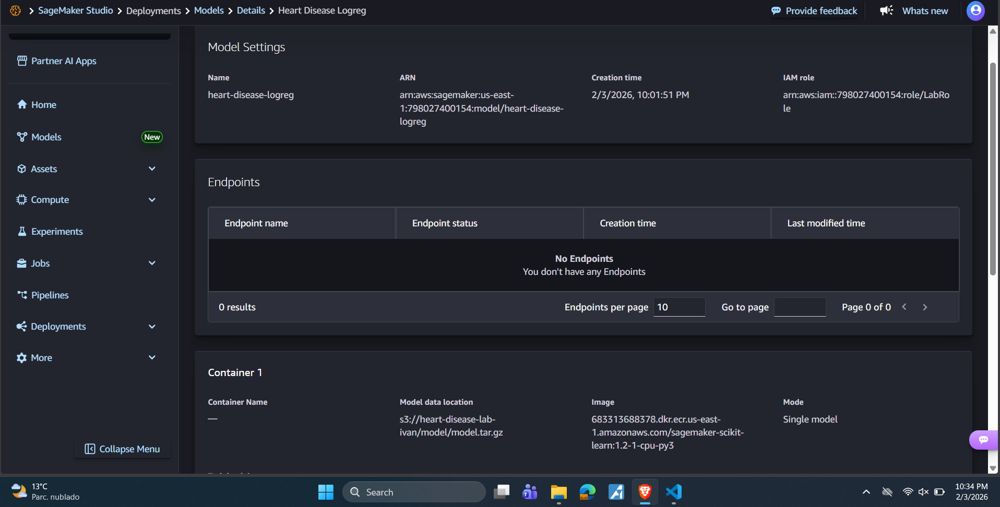
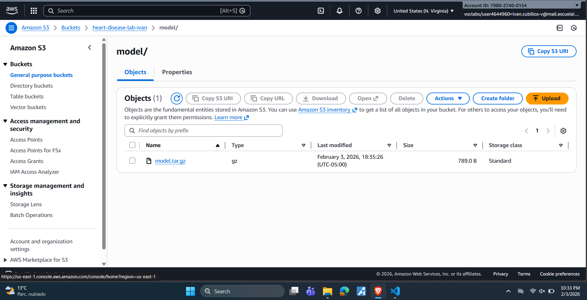
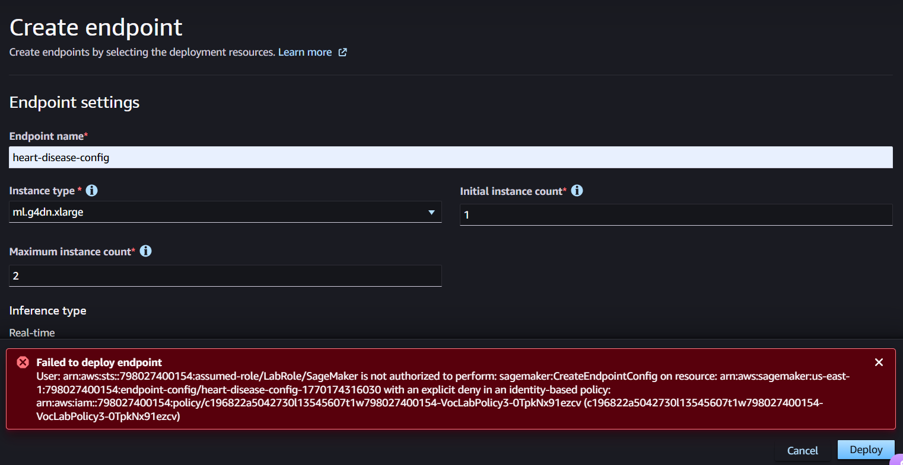

# Heart Disease Prediction using Logistic Regression

## Exercise Summary
This project implements **logistic regression from scratch** to predict the presence of heart disease using clinical data. The laboratory covers exploratory data analysis (EDA), model training with gradient descent, decision boundary visualization, L2 regularization, and an exploration of model deployment using Amazon SageMaker.

The objective is to reinforce theoretical concepts of binary classification while applying them to a real-world healthcare dataset.

---

## Dataset Description
- **Source:** Kaggle – Heart Disease Dataset  
  https://www.kaggle.com/datasets/neurocipher/heartdisease
- **Samples:** 270 patients
- **Target Variable:**  
  - `1` → Presence of heart disease  
  - `0` → Absence of heart disease
- **Features:**  
  Age, Cholesterol, Resting Blood Pressure, Maximum Heart Rate, ST Depression, Number of Vessels, among others.
- **Class Distribution:** Approximately 55% presence, 45% absence.

---

## Methodology
1. **Exploratory Data Analysis (EDA)**
   - Statistical summaries
   - Class distribution
   - Feature correlations
   - Visualization of feature behavior by class

2. **Logistic Regression Implementation**
   - Sigmoid function
   - Binary cross-entropy loss
   - Gradient descent optimization
   - Model evaluation using Accuracy, Precision, Recall, and F1-score

3. **Decision Boundary Visualization**
   - Training models on selected 2D feature pairs
   - Visualization of linear decision boundaries
   - Analysis of separability and feature interaction

4. **Regularization**
   - L2 regularization added to cost function and gradients
   - Evaluation of multiple λ values
   - Analysis of weight magnitudes and performance impact

---

## Results
- The model achieved consistent performance on both training and test sets.
- Regularization reduced weight magnitudes and improved generalization.
- Certain features such as age and cholesterol showed stronger influence on predictions.
- Linear decision boundaries revealed partial separability and feature overlap.

---

## Deployment on Amazon SageMaker
The trained model was exported and uploaded to Amazon S3. The deployment pipeline for a real-time inference endpoint using Amazon SageMaker was implemented.

However, endpoint creation failed due to **explicit IAM permission restrictions** in the laboratory AWS environment, which prevent the execution of the `CreateEndpointConfig` action. This limitation is related to the educational AWS account configuration and not to the model or deployment code.

Despite this restriction, the full deployment workflow was explored and validated up to the endpoint creation stage.

### Process Overview
1. **Model Export:** Trained weights and bias exported as NumPy arrays
2. **S3 Upload:** Model artifacts uploaded to `s3://heart-disease-lab-ivan/model/`
3. **SageMaker Model Creation:** Successfully created model resource
4. **Endpoint Deployment:** Failed due to IAM restrictions

### Evidence

#### 1. Jupyter Lab Environment

*SageMaker notebook instance running the training code*

#### 2. Model Created in SageMaker

*Model "Heart Disease Logreg" successfully registered in SageMaker*

#### 3. S3 Bucket with Model Artifacts

*model.tar.gz uploaded to S3 bucket*

#### 4. Deployment Error

*Error message showing IAM permission denial for CreateEndpointConfig*

**Cause:** The AWS Academy Learner Lab environment has restricted IAM policies that prevent endpoint configuration creation.

**Workaround attempted:** None available - this is a hard limit in educational AWS accounts.

**Production deployment:** In a real AWS environment with proper permissions, the endpoint would be created successfully and could serve predictions via:
```python
import boto3
runtime = boto3.client('sagemaker-runtime')
response = runtime.invoke_endpoint(
    EndpointName='heart-disease-endpoint',
    ContentType='application/json',
    Body=json.dumps({'features': [60, 300, 140, 120, 2.3, 1]})
)
```
---
## Author
Ivan Cubillos
Ingenieria de Sistemas